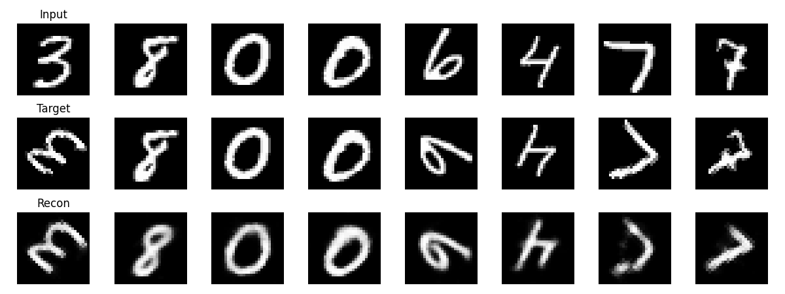

# 🌍 World Model Studio

> **学习理解与预测环境动态**

[](https://www.python.org/)
[](https://pytorch.org/)
[](LICENSE)

---

## 📖 概述

World Model Studio 是一个专注于构建**世界模型 (World Model)** 的深度学习研究框架 —— 这类神经网络能够学习环境动态的内部表征并预测未来状态。项目灵感源自 VAE、VQ-VAE、JEPA 和 RSSM 等经典工作，为时空预测任务提供统一、模块化的架构设计。




### ✨ 核心特性

- **多种架构**: VAE、VQ-VAE、JEPA、RSSM — 全部支持可互换的骨干网络
- **混合注意力**: MLA (多头潜变量注意力) + MoE (混合专家系统) 设计
- **CUDA 加速**: 自定义融合算子用于归一化和演化操作
- **视觉优先设计**: 针对 MNIST 和全分辨率游戏帧优化的编码器
- **端到端训练**: 内置可视化、日志记录和检查点功能

---

## 🏗️ 架构

### 系统设计

```
┌─────────────────────────────────────────────────────────────────────────┐
│                         World Model Studio                              │
├─────────────────────────────────────────────────────────────────────────┤
│  ┌─────────────┐    ┌──────────────┐    ┌─────────────┐                │
│  │   Vision    │───▶│  Projection  │───▶│   Latent    │                │
│  │  (Encoder)  │    │  (Feature→   │    │ Constraint  │                │
│  │             │    │   Token)     │    │ (VAE/VQ)    │                │
│  └─────────────┘    └──────────────┘    └──────┬──────┘                │
│                                                │                        │
│  ┌─────────────┐    ┌──────────────┐    ┌──────▼──────┐                │
│  │   Vision    │◀───│  Projection  │◀───│  Predictor  │                │
│  │  (Decoder)  │    │  (Token→     │    │ (Optional)  │                │
│  │             │    │   Feature)   │    │             │                │
│  └─────────────┘    └──────────────┘    └─────────────┘                │
└─────────────────────────────────────────────────────────────────────────┘
```

### 核心模块

| 模块 | 位置 | 描述 |
|------|------|------|
| **Vision** | `src/world/vision/` | 任务专用编码器/解码器 (MNIST, Sekiro) |
| **Projection** | `src/world/projection/` | 特征↔Token 空间转换 |
| **Latent** | `src/world/latents/` | 隐空间约束 (VAE 重参数化 / VQ 量化) |
| **Dream** | `src/world/dream/` | 高层世界模型框架 |
| **Predictor** | `src/world/predictor/` | 时序/空间精炼模块 |

### 模型家族

| 架构 | 隐空间类型 | 骨干网络选项 | 应用场景 |
|------|-----------|-------------|---------|
| **VAE** | 连续 (高斯分布) | FC / Conv / ResNet | 重建、生成 |
| **VQ-VAE** | 离散 (码本) | FC / Conv / ResNet | 压缩、规划 |
| **JEPA** | 表征式 | FC / Conv / ResNet | 自监督预测 |
| **RSSM** | 状态空间 (RNN) | FC / Conv / ResNet | 序列决策 |

### 高级组件

#### MLA + MoE 配置

项目采用受 **DeepSeek 启发** 的架构，融合多头潜变量注意力与混合专家系统：

```python
@dataclass
class WorldConfig:
    hidden_dim: int = 576          # 隐藏层维度
    n_layer: int = 8               # Transformer 层数
    n_head: int = 8                # 注意力头数
    n_kv_head: int = 2             # KV 头数 (GQA)
    
    # MLA: 潜变量压缩的高效注意力
    kv_lora_rank: int = 32         # KV 缓存压缩秩
    q_lora_rank: int = 32          # Query 压缩秩
    
    # MoE: 稀疏专家混合
    num_experts: int = 8           # 总专家数
    num_experts_per_tok: int = 2   # 每个 token 激活专家数
    num_shared_experts: int = 1    # 常激活共享专家
```

#### CUDA 算子

| 算子 | 位置 | 描述 |
|------|------|------|
| **ECR** | `src/model/ecr/` | 融合深度卷积的高效交叉残差块 |
| **Norm2D** | `src/model/components/cuda_norm/` | 面向视觉张量的融合 RMSNorm2d/LayerNorm2d |

---

## 🚀 快速开始

### 安装

```bash
# 克隆仓库
git clone https://github.com/your-username/world-studio.git
cd world-studio

# 安装依赖 (请先创建虚拟环境)
pip install torch torchvision numpy matplotlib tensorboard
```

### 训练示例

#### MNIST 旋转预测

```bash
# 训练 VAE 预测旋转后的 MNIST 数字
python scripts/mnist/train_vae.py

# 训练 VQ-VAE 学习离散表征
python scripts/mnist/train_vqvae.py
```

#### Sekiro 游戏帧重建

```bash
# 在全分辨率游戏帧 (128x240) 上训练 ConvVAE
python scripts/sekiro/train_vae.py

# 使用对抗损失训练以获得更清晰的重建
python scripts/sekiro/train_vqvae.py
```

### 监控训练

```bash
# 启动 TensorBoard
tensorboard --logdir=logs/sekiro/vae

# 在浏览器中查看：http://localhost:6006
```

---

## 📁 项目结构

```
world-studio/
├── scripts/                 # 训练脚本（按任务分类）
│   ├── mnist/              # MNIST 实验
│   ├── sekiro/             # 只狼实验  
│   └── tools/              # 性能分析工具
├── src/
│   ├── datasets/           # 数据集封装
│   ├── model/              # 核心模型组件
│   │   ├── backbone/       # 注意力、MoE、Transformer 块
│   │   ├── components/     # 可复用层 (归一化、ResNet、损失)
│   │   ├── ecr/            # CUDA 演化算子
│   │   └── world/          # 基础模型类
│   ├── world/              # 模块化世界模型框架
│   │   ├── vision/         # 任务专用编码器
│   │   ├── projection/     # 特征 -Token 投影
│   │   ├── latents/        # VAE/VQ 约束
│   │   ├── dream/          # 高层框架
│   │   └── predictor/      # 预测模块
│   └── utils/              # 训练工具
├── configs/                # 配置数据类
├── outputs/                # 结果与检查点
├── logs/                   # TensorBoard 日志
└── tests/                  # 单元测试
```

---

## 📊 结果与可视化

每个训练 epoch 自动生成：

- **重建对比图**: Input / Target / Prediction 并排显示
- **损失曲线**: 训练/验证指标随时间变化
- **TensorBoard 日志**: 标量、直方图、图像摘要

输出目录结构：
```
outputs/
├── results/
│   ├── sekiro/vqvae/
│   │   ├── epoch_1.png
│   │   ├── epoch_2.png
│   │   └── ...
├── models/
│   ├── sekiro_vqvae.pth
│   └── mnist_vae.pth
```

---

## ⚙️ 配置

### 模型选择

```python
# 选择骨干网络
from src.world.vision.sekiro import SekiroConv, SekiroResNet

vision = SekiroResNet(block=BasicBlock, num_blocks=[2, 2, 2, 2])

# 配置隐空间
from src.world.latents.vq import VQLatent
latent = VQLatent(num_embeddings=1024, embedding_dim=64)
```

### 超参数

```python
# VAE 设置
beta = 1.0           # KL 散度权重 (β-VAE)
latent_dim = 256     # 隐空间通道维度

# RSSM 设置  
seq_len = 8          # 序列长度
action_dim = 4       # 动作空间维度
```

---

## 🛠️ 开发

### 代码风格

- **类型注解**: 函数签名使用 Python 类型注解
- **命名规范**: 类名 PascalCase，函数/变量名 snake_case
- **文档字符串**: 公共 API 需包含清晰描述

### 添加新模型

1. 在 `src/model/world/` 中继承基类
2. 实现 `encode()`、`decode()` 和 `forward()`
3. 在 `scripts/{task}/` 中添加训练脚本
4. 在 `tests/` 中编写单元测试

### 运行测试

```bash
# 运行所有测试（如有）
python -m pytest tests/
```

---

## 📝 许可证

本项目采用 [MIT 许可证](LICENSE)。

---

## 🙏 致谢

- **VAE**: Kingma & Welling (2013) — Auto-Encoding Variational Bayes
- **VQ-VAE**: Oord et al. (2017) — Neural Discrete Representation Learning
- **JEPA**: LeCun et al. — Joint Embedding Predictive Architectures
- **RSSM**: Hafner et al. (2019) — Learning Latent Dynamics for Planning
- **DeepSeek**: MLA + MoE 架构灵感

---

## 📬 联系

如有问题或合作，请提交 Issue 或联系维护者。

---

<div align="center">

**为世界模型研究而生 ❤️**

[⬆ 返回顶部](#-world-model-studio)

</div>
